<div align="center">

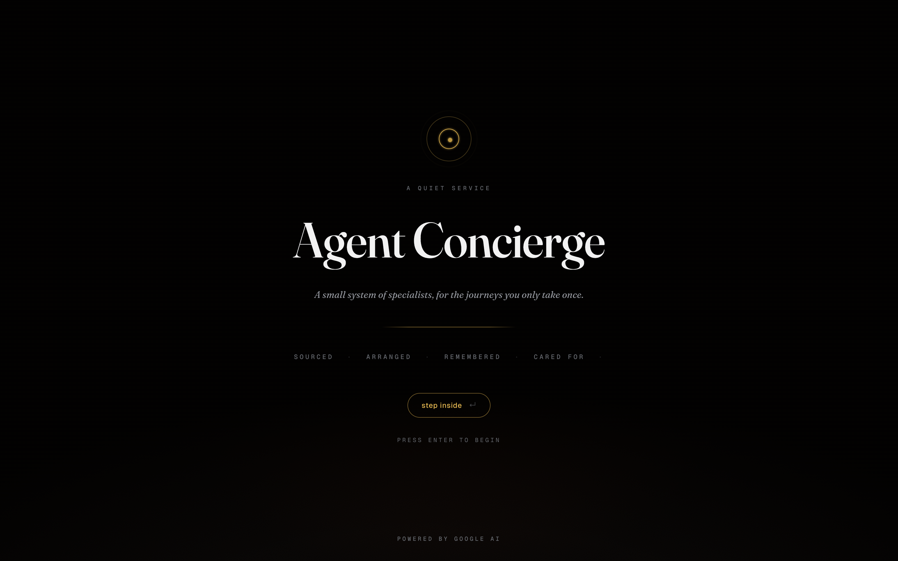

# Agent Concierge

**A working prototype of what bespoke, agent-driven travel planning feels like in 2026.**
Multi-agent. Multi-skill. Memory-aware. Long-context-disciplined.
Runs entirely in the browser, zero backend.

<code>./app.sh start</code> &nbsp;·&nbsp; <a href="#run-it">90-second setup</a> &nbsp;·&nbsp; <a href="#the-experience">the experience</a> &nbsp;·&nbsp; <a href="#architecture">architecture</a> &nbsp;·&nbsp; <a href="#concept-glossary">concepts</a>

</div>

---

## The one-paragraph version

Most agent demos are a chat box with a spinner. This one shows a coordinator delegating in parallel to five specialists, loading skills on demand, remembering preferences across sessions, iterating a deep-research loop you can watch, emitting a live workspace of itineraries, hotels, hospitality tiers, and pricing — and pausing mid-turn for a human-in-the-loop approval before issuing a printable dossier. It ships with three click-through explainers (an interactive architecture tour, a 13-act cinematic of the whole system, and a Bloomberg-style planning command centre), a 12-moment post-sales hyper-care journey rendered as an iPhone lock screen, and a print-ready PDF of the final plan in concierge voice. Built for a live demo; reads like a serious product.

It is a **reference prototype**. Not a product. Not an SDK. A code sample you can fork, learn from, strip to the bones, and graft into a real system.

---

## 60 seconds

**Prerequisite:** Node 20+ (the only one).

```sh
git clone https://github.com/vmishra/Agentic-Concierge
cd Agentic-Concierge
./app.sh start
```

That is the whole story. The script checks for Node, runs `npm install` on first run (and on `git pull`s that changed dependencies), starts Vite, waits until the server is ready, and prints the URL. Use `./app.sh stop` to shut it down, `./app.sh logs` to tail, `./app.sh restart` for the obvious.

No Node on the machine yet?

- **macOS**: `brew install node`
- **Linux**: `curl -o- https://raw.githubusercontent.com/nvm-sh/nvm/v0.40.1/install.sh | bash && nvm install 20`
- **Windows**: download the LTS from https://nodejs.org

Default mode is **Mock** — deterministic, no network, no keys. Pick any of the three seeded prompts on the empty state and the scenario plays out in front of you.

---

## The experience

### Intro curtain · first session only

Opens over the app when a new browser session begins. Breathing champagne mark, a tagline in italic Fraunces, four capability words across a hairline, *step inside* CTA. `sessionStorage` remembers you're in; a hard reload mid-demo doesn't replay it. Close the browser → next session sees it fresh.

> *"A small system of specialists, for the journeys you only take once."*

### The main conversation

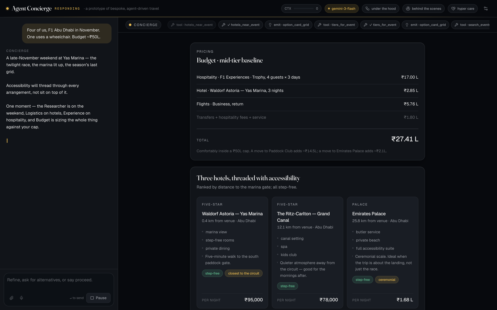

A dual-pane surface. **Chat** on the left — the Concierge is the only voice you hear; a green `online` dot next to the wordmark turns champagne `responding` when the agent is working. **Workspace** on the right — where specialists' artifacts materialise: the itinerary, the hospitality tiers, the hotel grid, the pricing breakdown.

Above the workspace, an **activity ribbon** shows skill loads, tool calls, sub-agent dispatches, memory reads, research iterations, and context compactions as they happen. Above the chat input, a quick-reply row surfaces refinement chips — always with a **Proceed** escape so the conversation can be concluded at any time.

### Refinement in place

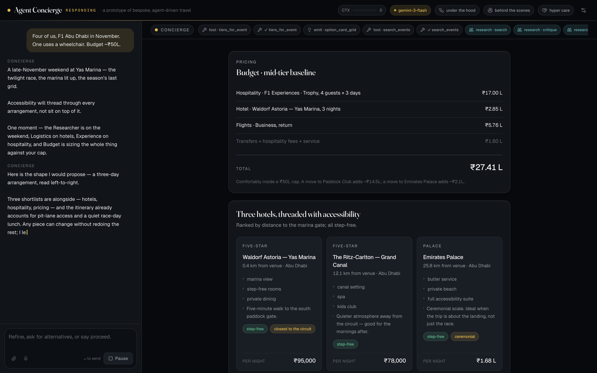

Click `Closer to the pit lane` and the Experience specialist re-runs with the new constraint. The hospitality tier grid **updates in place** (stable artifact IDs — no stacking), the ribbon shows `Concierge → Experience` alone (not the full fan-out again), and the Concierge acknowledges in character: *"Pit-lane it is. Paddock Club tends to win on this dimension — forty minutes on the Thursday walk alone…"*

### Live pricing

Click a different hotel card or upgrade a hospitality tier from the option grid and the `pricing_breakdown` re-computes instantly — new line label, new amount, new total. Pure client-side reactivity; no round-trip to the agent. Ask *"what is the total cost?"* and the Concierge quotes the exact same number that's on screen.

### Human-in-the-loop · real tool call

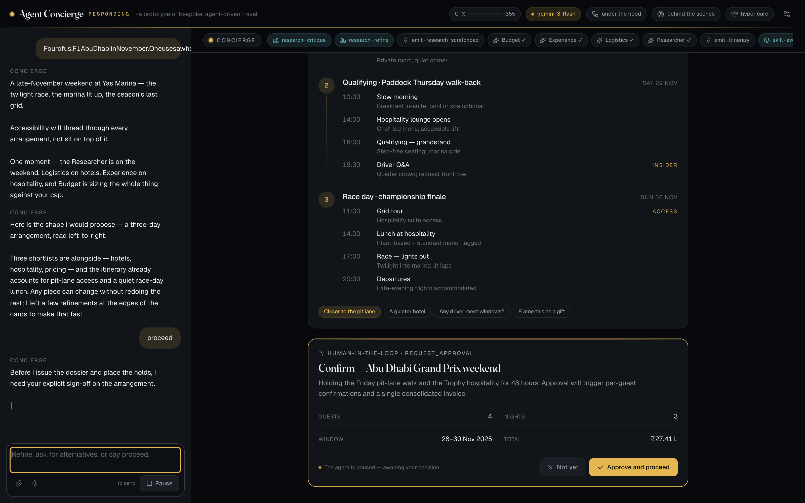

When you say `proceed`, the agent does *not* just issue a dossier. It calls `request_approval`, a tool that blocks on a `HitlBus` promise. An `approval_request` A2UI artifact appears with Approve / Not yet controls; the user's click resolves the promise; the tool returns a structured decision; the runner's ordinary tool loop resumes. Human oversight is a **first-class capability** in the architecture, not a retrofit.

### Dossier

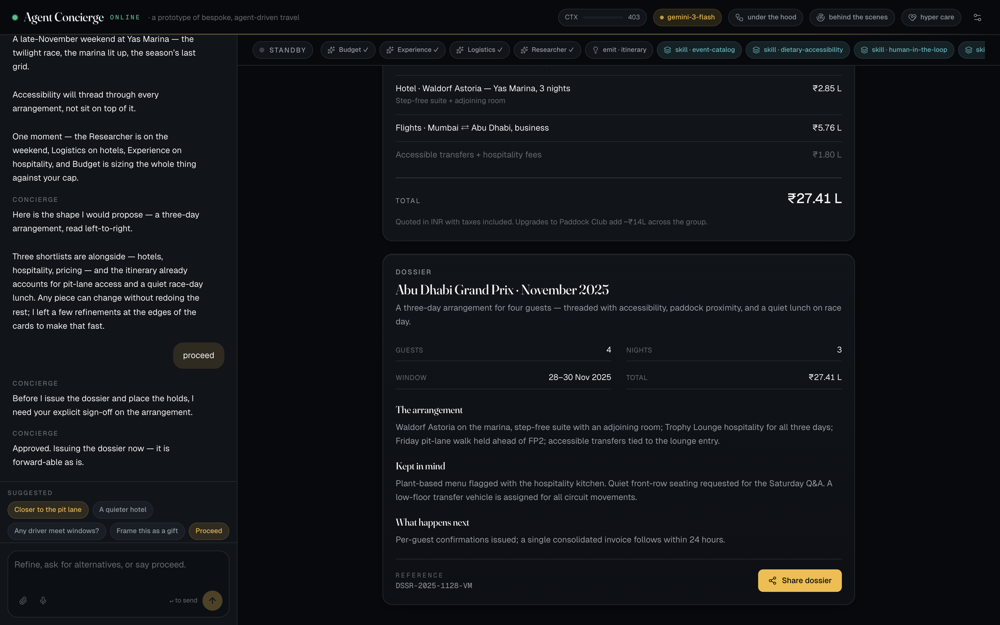

On approval, a final dossier card appears — three sections, a meta row (guests / nights / window / total), and a quiet hairline at the bottom with the reference number and a **Share dossier** button.

### Share dossier · print-ready PDF

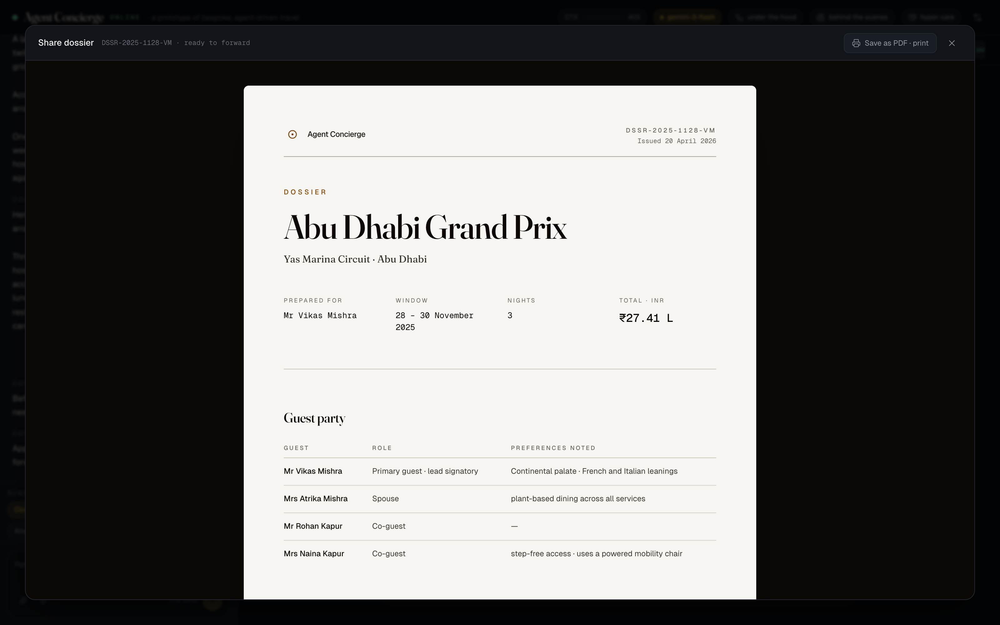

Cream A4-proportioned paper on a dark backdrop, generous shadow. Editorial typography: Fraunces display headers, Geist body, all on a cream stock.

- **Cover** — *Dossier* eyebrow in warm gold, event title in 54px Fraunces, city subtitle, 4-up row: *Prepared for · Window · Nights · Total · INR*
- **Guest party** — proper table with Mr Vikas Mishra, Mrs Atrika Mishra (plant-based dining), Mr Rohan Kapur, Mrs Naina Kapur (step-free · powered mobility chair). Vikas's note: *"Continental palate · French and Italian leanings"*.
- **The arrangement** — Stay (Waldorf Grand Marina Suite + adjoining Deluxe, butler named, arrival detail), Hospitality (Trophy Lounge · chef-led menu · Friday pit-lane walk held · Saturday Q&A front row), Flights (EK 508/507 with class and seats), Transfers, Cultural threads (Zuma Friday, Louvre Thursday, Waldorf Sunday)
- **Kept in mind** — Accessibility and Dietary bullets in concierge voice
- **Financials** — line-by-line in INR, total in big Fraunces numerals
- **Terms** — six-up grid: payment · cancellation · third-party · rates · dress code · confidentiality
- **Concierge contact** and **signature lines**

Click **Save as PDF · print** in the header; a dedicated `@media print` stylesheet hides every other element and repositions the paper flush to the top-left, so the output is *just the document* — no app chrome.

---

## Under the hood · interactive architecture tour

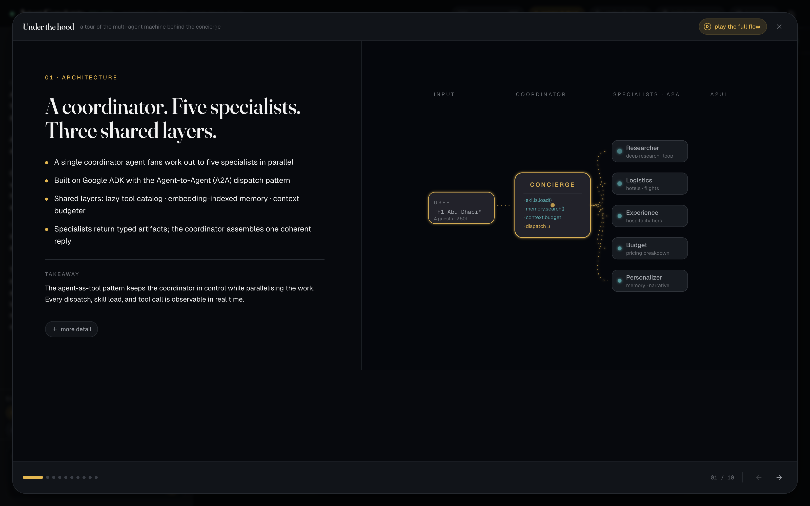

Ten click-through slides, each one a slide-deck beat: kicker, title, four bullet points, a one-line takeaway. Every slide has a **+ more detail** toggle that reveals a paragraph, a code snippet, and the source path in the repo.

1. **Architecture** — coordinator + five specialists + three shared layers
2. **Agent hierarchy** — `agent-as-tool` is recursive; trees are arbitrarily deep
3. **Skills · on-demand context** — instructions + tools + resources, loaded at the right moment
4. **Tools · manifests first** — lightweight manifests, dynamic `import()` at call time, `Promise.all` parallel fan-out
5. **Memory · repeat-user personalisation** — short-term session + long-term embedding-indexed by `gemini-embedding-2`
6. **A2UI · generative UI** — agents emit typed JSON against a pre-approved component catalog
7. **Human-in-the-loop** — `request_approval` is an async tool; the runner's loop naturally pauses and resumes
8. **Runner** — one file, ~300 lines, provider-agnostic
9. **Deep research · LoopAgent** — plan → search → critique → refine, with a live scratchpad
10. **Long-context management** — a 1M-token window with compaction discipline

Each slide carries an animated SVG diagram — glow-filter arrows, flowing-dash overlays, pulsing nodes, staged reveals. Motion is deliberately slow: each label has time to land before the next draws in.

### Immersive flow · play the whole system

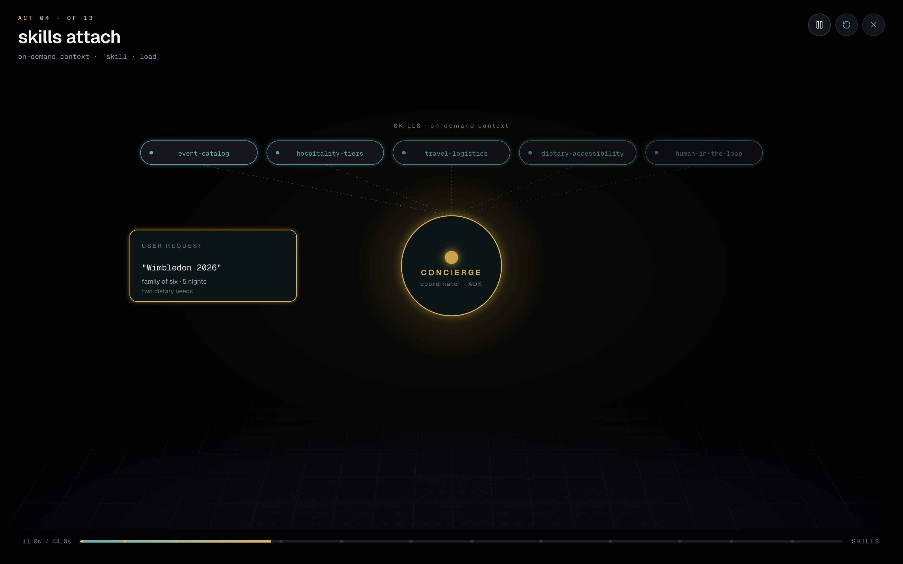

A **play the full flow** button in the tour header opens a full-screen cinematic. 13 acts × ~4 seconds = ~45 seconds end-to-end on a 3D-perspective stage with a recessed ground grid:

1. the stage · an empty system, ready
2. user submits · *"Wimbledon 2026 · family of six"*
3. concierge receives · the coordinator wakes
4. skills attach · on-demand · `skill · load`
5. memory recall · `gemini-embedding-2` · top-k search
6. parallel dispatch · five specialists via A2A
7. tools fire · manifests load · `Promise.all`
8. deep research · plan → search → critique → refine
9. a2ui artifacts · typed components stream back
10. human approval · `request_approval` · turn paused
11. context compaction · −120k tokens
12. dossier delivered · single cohesive response
13. powered by Google AI · ADK · A2A · A2UI · Gemini 3 Flash · gemini-embedding-2

Play / pause, restart, close. Keyboard shortcuts: `←` prev, `→` next, `space` toggle. Each act title is Geist Sans at 32px — technical-readout, not editorial.

---

## Behind the scenes · the planning command centre

A Bloomberg-terminal-grade dashboard showing what a real concierge operator sees *before* an agent ever meets a guest. Seven sections, dense data, AI-read callouts, a **live anomaly ticker** in the header, and an **agent provenance rail** in the sidebar footer that lists what each agent has done recently.

### Annual planning board

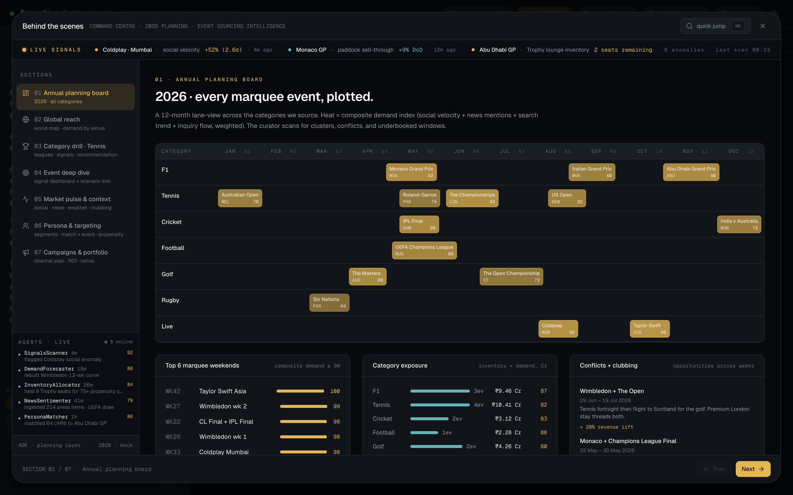

Twelve-month horizontal strip, seven category rows (F1 · Tennis · Cricket · Football · Golf · Rugby · Live). Each event is a demand-intensity chip; click any → drop straight into its deep-dive. Top-6 marquee weekends on the right, category exposure summary, clubbing opportunities panel.

### Global reach

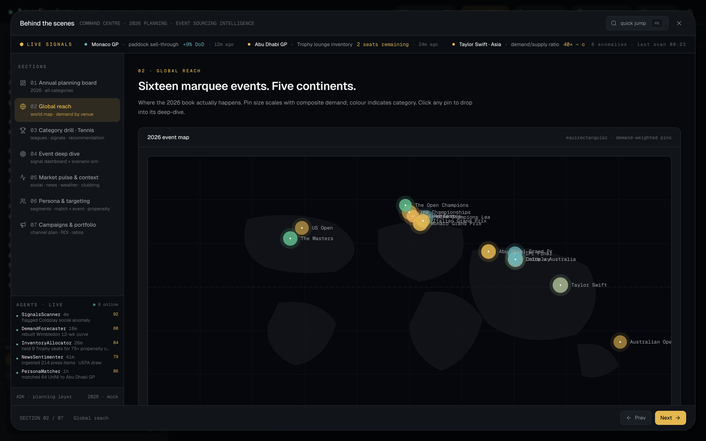

Equirectangular world map with 16 venue pins sized by composite demand and coloured by category. Subtle continent blobs behind the pins for geographic hint. Regional book panel (₹ per region) + category legend.

### Event deep dive · with scenario simulator

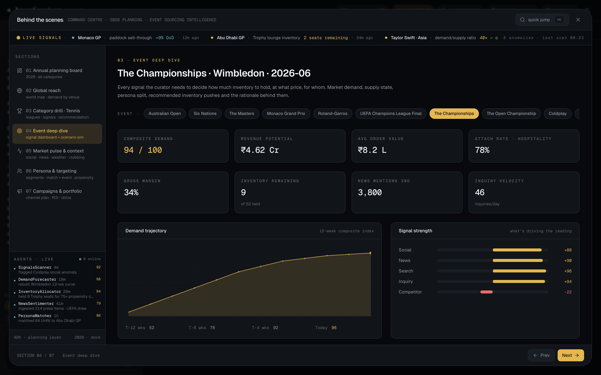

Eight metric cards (composite demand, revenue potential, AOV, attach rate, margin, inventory remaining, news mentions, inquiry velocity). Big demand-trajectory chart. Signal-strength bars. Persona split. Past attendees. **Scenario simulator** at the bottom with three sliders — price ladder, hospitality attach lift, inventory release — with revenue, margin, and attach projections that update live.

Event-selector chip row at the top lets the curator flip between all 16 marquee events without leaving the section.

### Persona & targeting

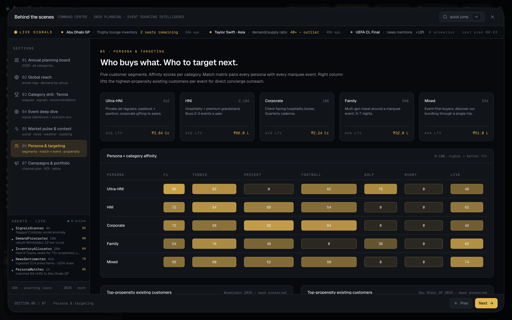

Five segment cards (UHNI, HNI, Corporate, Family, Mixed) with counts and average LTV. Full persona × category affinity heat matrix (0–100). Top-propensity existing customers per event — masked names, persona tags, last-booked dates, propensity scores.

Plus two more sections: **Market pulse** (social chatter volume bars, news mentions, weather snapshots per venue-month, holiday calendar overlay, clubbing opportunities) and **Campaigns & portfolio** (suggested campaigns by channel with budget and projected ROI, top-10 events by revenue, CFO-style portfolio ratios).

Throughout: a quiet `AI read` callout per section with a strategic insight, Sparkles badge, confidence score, and `gemini-3-flash · thinking: medium · signals ingested across 14 sources` provenance line.

A `⌘K` command palette lets the curator jump to any section, event, or action (*run anomaly scan · export Q2 brief · compare Wimbledon vs Masters*).

---

## Hyper Care · the post-sales journey

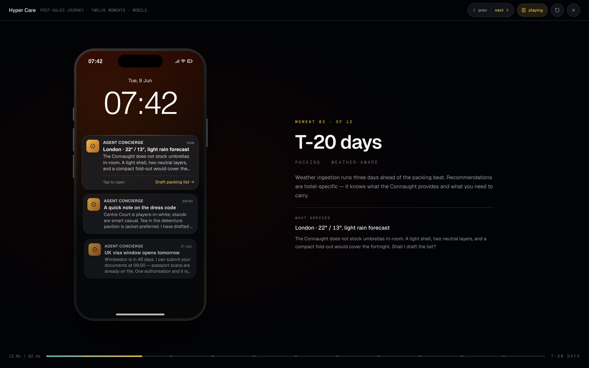

The agent does not stop at the booking. **Twelve moments**, T-45 days through the return home, each surfacing as an iOS-accurate notification on a detailed iPhone lock screen — dynamic island, side-button hints, status bar, warm champagne radial wallpaper glow, thin-weight clock, home indicator.

| Day | Moment |
|-----|--------|
| T-45 | UK visa window opens tomorrow |
| T-30 | A quick note on the dress code |
| T-20 | London · 22° / 13°, light rain forecast — packing list? |
| T-15 | A quiet V&A morning — would you like to hold it? |
| T-10 | Core by Clare Smyth holds a table |
| T-7  | £2,400 forex card — home delivery? |
| T-3  | BA 138 check-in opens at 14:00 |
| T-2  | Airport pickup tomorrow? (Ramesh, 4.9 repeat) |
| T-1  | Return drop planned — 12 Jul, 06:30 |
| +1   | London, now — four small things |
| +6   | Ground-side at Gate 5 · everything alright? |
| +14  | A quiet dossier of the fortnight, ready to share |

Auto-plays at ~5s per beat; commentary panel on the right explains what the agent is reading and why the moment matters; dedicated **play all** toggle, **prev / next clicker**, timeline tick-marks are clickable for non-sequential scrubbing. Keyboard: `←` prev · `→` next · `space` play/pause · `r` restart.

---

## Architecture

```
                            ┌─────────────────────────┐
                    user ─▶ │ Concierge (coordinator) │  ◀── skills: event-catalog,
                            └───────────┬─────────────┘       dietary-accessibility,
                                        │                      human-in-the-loop
                      ┌──── agent-as-tool (A2A-shaped) ────┐
                      ▼                                    ▼
   ┌─────────────┬───────────────┬───────────────┬─────────────────┐
   │             │               │               │                 │
   ▼             ▼               ▼               ▼                 ▼
Researcher   Logistics       Experience        Budget          Personalizer
(LoopAgent)  hotels,         hospitality      pricing          memory recall,
plan→search  flights,        tiers +          breakdown        gifting
→critique    transfers       insider                            narrative

   ▲                                  ▲                   ▲
   │ tool manifests                   │ A2UI artifacts    │ HitlBus
   │ loaded on-demand                 │ emitted into      │ awaits human
   │ per skill                        │ the workspace     │ approval

  Tool Catalog     Skill Registry     A2UI Renderer      Memory Service
  (lazy load())    on-demand bundles  typed components   embedding-indexed
                   of instructions +  itinerary ·        localStorage ·
                   tools + resources  option_grid ·      gemini-embedding-2
                                      pricing ·          (Live mode)
                                      research_scratchpad
                                      · approval_request · ...

                          Context Budget
                          compacts older turns
                          into priorSummary
                          once >30% of 1M window
```

All of that lives in `src/adk/` — a deliberately small, didactic ~900-LOC framework that mirrors Google ADK's primitives. ADK itself is server-side; this repo is a browser-friendly reference for teams who want to learn the shape.

### The ADK layer, in code

Defining a specialist:

```ts
const experience = new LlmAgent({
  name: 'Experience',
  description: 'Hospitality tiers — paddock, debenture, pavilion, corporate suites.',
  skills: ['hospitality-tiers'],
  systemPrompt: `You are the Experience specialist. Use tiers_for_event to
    surface three tiers that genuinely differ. Copy is understated; never
    promise, always arrange.`,
})
```

A skill — instructions + tools bundled together, lazy-loaded:

```ts
export const hospitalityTiersSkill: Skill = {
  name: 'hospitality-tiers',
  description: 'Paddock, debenture, pavilion — what each tier includes.',
  instructions: 'Explain tiers in concrete terms; be specific.',
  tools: [
    defineLazyTool(
      { name: 'tiers_for_event', description: '…', input: { /* JSON-Schema */ } },
      async () => defineTool(/* implementation loaded only when called */),
    ),
  ],
}
```

Human-in-the-loop as an async tool:

```ts
// src/skills/human-in-the-loop.ts
// request_approval awaits the user's click on the ApprovalCard
const decision = await hitlBus.await(requestId)
return { approved: decision.approved, note: decision.note }
```

Running a turn:

```ts
await run(concierge, userInput, runtime, {
  session,
  onTrace:    (t) => ribbon.push(t),      // skill.load, tool.call, memory.read, …
  onArtifact: (a) => workspace.push(a),   // itinerary, option_card_grid, …
  onDelta:    (text) => chat.append(text),
})
```

That's the entire public surface. The runner handles skill loading, tool dispatch, sub-agent delegation, memory injection, context compaction, streaming, and the HITL pause — and stays under 350 lines. See `src/adk/runner.ts`.

---

## Two modes

<table>
<tr>
<td width="50%" valign="top">

### Mock <small>· default</small>

Deterministic. Scripted. Zero network.

Scenarios live in `src/scenarios/`. Each *beat* decides what the coordinator says and which specialists it calls — but **the tools themselves run for real**, filtering the hotel catalog, ranking hospitality tiers, computing pricing. Refinement chips actually re-filter.

This is the mode to demo live.

</td>
<td width="50%" valign="top">

### Live <small>· Gemini 3 Flash</small>

Reads `VITE_GEMINI_API_KEY` from `.env.local`. Routes through `@google/genai` to **Gemini 3 Flash** — 1M-token context, multimodal, configurable thinking. Memory embeddings via **gemini-embedding-2**.

The agent topology, skills, memory service, A2UI renderer, and activity ribbon are **identical** — only the provider swaps.

```sh
cp .env.example .env.local
# set VITE_GEMINI_API_KEY=…
./app.sh restart
```

Browser-exposed keys are a prototype-only pattern.

</td>
</tr>
</table>

---

## Run it

```sh
./app.sh start          # install deps if needed, start dev server, wait until ready
./app.sh stop           # shut it down
./app.sh restart        # the obvious
./app.sh status         # show state + URL
./app.sh logs           # tail the dev server log
./app.sh build          # production build into dist/

PORT=5174 ./app.sh start
```

Direct npm commands also work:

```sh
npm install
npm run dev             # http://localhost:5173
npm run typecheck       # tsc -b
npm run test            # vitest — 7 tests covering orchestration + memory
npm run build
```

---

## Three canonical scenarios

All baked into Mock mode. Each uses the same agents, skills, and A2UI renderer — only the scripts differ.

**F1 Abu Dhabi · corporate gifting.** Four guests, one wheelchair, ₹50L budget, late November. Total: **₹27.41 L**. Demonstrates: accessibility threading, parallel dispatch, pit-lane refinement, paddock-meet insider, "remember my partner is vegan", proceed → HITL approval → dossier.

**Wimbledon · family fortnight.** Three adults, three children, five nights, V&A morning and a West End matinee woven in, pavilion dietary brief. Total: **₹70.00 L**. Demonstrates: family-friendly shape, Centre Court debenture upgrade path, cultural day included.

**Wankhede Test · corporate hospitality.** Group of ten, first-time travelling together, Mumbai, weather buffer. Total: **₹26.60 L**. Demonstrates: group dynamics, insider briefing window (former captain), contingency planning.

---

## Concept glossary

<dl>
<dt><strong>Coordinator</strong></dt>
<dd>An <code>LlmAgent</code> whose job is to <em>route</em> work, not do it. In ADK, sub-agents are exposed as tools so calls route through the coordinator — the guest sees one voice.</dd>

<dt><strong>Agent-as-tool</strong></dt>
<dd>Wrapping a sub-agent so the coordinator can invoke it as just another function call. Unlike hand-offs, the coordinator retains agency and merges results. Also the shape of the emerging <em>A2A</em> (Agent-to-Agent) protocol.</dd>

<dt><strong>Skill</strong></dt>
<dd>A bundle of <em>instructions + tools + (optional) resources</em> that only attaches when the coordinator decides it is needed. Keeps the prompt lean and makes tool-loading a first-class, visible concept.</dd>

<dt><strong>Tool</strong></dt>
<dd>A typed function with a JSON-Schema input. Registered as a manifest; implementation loaded via dynamic <code>import()</code> when about to be called. Parallel fan-out is the default.</dd>

<dt><strong>Memory Service</strong></dt>
<dd>A long-term store with embedding-indexed search. <code>add()</code> ingests a fact; <code>search()</code> retrieves top-k by cosine similarity. Backed by localStorage here; production wiring would use Vertex AI Memory Bank or Firestore.</dd>

<dt><strong>A2UI</strong></dt>
<dd>Google's emerging <a href="https://a2ui.org">Agent-to-UI protocol</a>. The agent emits declarative component JSON; the frontend renders from a pre-approved catalog. Safer than arbitrary HTML; more portable than screenshots; interactive by default.</dd>

<dt><strong>Workflow agents</strong></dt>
<dd><code>SequentialAgent</code>, <code>ParallelAgent</code>, <code>LoopAgent</code> — deterministic composers that arrange <code>LlmAgent</code>s into pipelines. Used inside the Researcher to make the deep-research loop visible.</dd>

<dt><strong>Human-in-the-loop</strong> (HITL)</dt>
<dd>A pattern where an agent pauses mid-turn and awaits a human decision. Here implemented as <code>request_approval</code> — an async tool that blocks on a <code>HitlBus</code> promise and returns a structured decision when the user clicks Approve / Not yet on an A2UI artifact.</dd>

<dt><strong>Context budget</strong></dt>
<dd>Approximate measurement of tokens in the live window. When usage crosses a soft fraction of the budget, older turns are compacted into a short summary. Discipline even with a 1M-token model.</dd>
</dl>

---

## Structure

```
Agentic-Concierge/
├── app.sh                   — one-shot start/stop/restart/status/logs/build
├── README.md                — this file
├── DESIGN.md                — the visual language, with reasoning
├── docs/screens/            — real screenshots used above
├── scripts/shoot.mjs        — puppeteer script that captures those screenshots
└── src/
    ├── styles/tokens.css    — OKLCH palette, type scale, motion presets
    ├── adk/                 — the ADK-shaped emulation layer (~900 LOC)
    │   ├── agent.ts  workflow.ts  tool.ts  skill.ts
    │   ├── memory.ts  context-budget.ts  callbacks.ts
    │   ├── a2ui.ts  hitl.ts  types.ts  provider.ts  runner.ts
    │   └── providers/
    │       ├── mock.ts      — scripted beat-driven provider
    │       └── gemini.ts    — @google/genai live adapter
    ├── agents/              — Concierge + five specialists
    ├── skills/              — six on-demand skill bundles (incl. human-in-the-loop)
    ├── data/                — events, hotels, hospitality, flights, personas
    ├── scenarios/           — f1-abu-dhabi, wimbledon, cricket + live pricing
    ├── ui/
    │   ├── Shell · ChatPane · Workspace · ActivityRibbon · SettingsSheet · Topbar
    │   ├── IntroCurtain     — first-session overture
    │   ├── a2ui/            — one React component per A2UI kind, incl. ApprovalCard + DossierShare
    │   ├── tour/            — ArchitectureTour + ImmersiveFlow + BehindTheScenes + HyperCare
    │   ├── components/      — Button · Chip · Kbd · Panel
    │   └── motion/          — shared transition presets
    ├── state/store.ts       — zustand app state, including live pricing recomputation
    ├── lib/                 — cn, format helpers
    └── tests/               — vitest (7 tests)
```

---

## Vocabulary

The product never says *book*, *click here*, *purchase*, *VIP experience*, or *package*. The concierge *arranges* and *curates*; the guest *holds* an option; a trip is a *weekend* or a *journey*. This is a deliberate choice — the voice is a tool. A luxury concierge isn't selling; they're anticipating. No exclamation marks. No emoji. No "Loading…" spinner.

See `DESIGN.md` for the full palette, typography, motion tokens, and reasoning.

---

## Tech stack

Vite + React 19 + TypeScript · Tailwind 4 (OKLCH-native) · `motion/react` v12 · Radix primitives for dialog / slider / popover · Lucide icons · Zustand · `@google/genai` · Vitest · Puppeteer (for the screenshot script). **~4,500 LOC of application code.** Zero external backend.

---

## What this is *not*

- Not production-ready. Browser-exposed API keys are a prototype pattern only.
- Not a complete concierge platform. No booking system, no payment, no real inventory.
- Not a finished ADK port. ADK itself is server-side; this is a browser-friendly reference.
- Not a universal UI kit. The A2UI renderer is tuned for this domain. Fork it and tune the catalog to yours.

---

## Roadmap, if you're forking

- Multimodal input — drag an event flyer image into chat
- Voice mode — press-to-talk mic + spoken dossier
- A2A peer agent — hand off finalised dossier to a local-ground-ops agent for confirmations
- Real Vertex AI Memory Bank wiring for cross-device persistence
- A comparison A2UI component that folds multiple option grids into one comparison table
- Snapshot tests on A2UI artifact output for visual-regression coverage

---

## License

MIT. See `LICENSE`. Use, fork, adapt — attribution appreciated but not required.

---

<div align="center">

<sub>Built by <a href="https://github.com/vmishra">Vikas Mishra</a> · <a href="https://github.com/vmishra/Agentic-Concierge">github.com/vmishra/Agentic-Concierge</a></sub>

</div>
